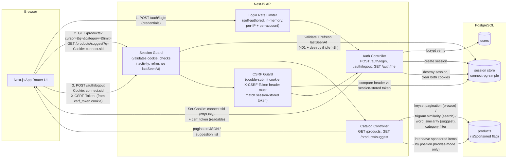
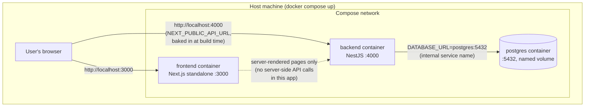

# Architecture

## System overview



## Auth flow (detail)

```mermaid
sequenceDiagram
    participant B as Browser
    participant N as NestJS API
    participant P as Postgres

    B->>N: POST /auth/login {email, password}
    N->>N: per-IP + per-account rate limit check
    alt over limit
        N-->>B: 429 Too Many Requests (Retry-After header)
    else within limit
        N->>P: SELECT user WHERE email = ?
        N->>N: bcrypt.compare(password, hash)<br/>(dummy hash compared even if no such user,<br/>so timing doesn't leak account existence)
        alt invalid credentials
            N-->>B: 401 (generic "Invalid email or password")
        else valid
            N->>N: regenerate session id (prevents session fixation)
            N->>N: generate CSRF token, store on session
            N->>P: INSERT session row (connect-pg-simple),<br/>userId + lastSeenAt = now() + csrfToken
            N-->>B: Set-Cookie: connect.sid=... (httpOnly)<br/>+ csrf_token=... (readable by JS); 200
        end
    end

    B->>N: GET /products or /products/suggest (Cookie: connect.sid=...)
    N->>P: SELECT session WHERE sid = ?
    alt no session / expired (now - lastSeenAt > 1h)
        N->>P: DELETE session row
        N-->>B: 401 (session expired, please log in again)
    else valid session
        N->>P: UPDATE session SET lastSeenAt = now()
        N->>P: query products (cursor/search/filter)<br/>or suggest (word_similarity)
        N-->>B: 200 + paginated products / suggestion list
    end

    B->>N: POST /auth/logout<br/>Cookie: connect.sid=...<br/>Header: X-CSRF-Token=... (read from csrf_token cookie)
    N->>N: compare X-CSRF-Token header<br/>vs session-stored csrfToken
    alt mismatch or missing
        N-->>B: 403 Forbidden (invalid or missing CSRF token)
    else match
        N->>P: DELETE session row
        N-->>B: clear both cookies (res.clearCookie); 200
    end
```

## Deployment topology (Docker Compose)



Note the asymmetry: the **browser** talks to the backend directly at `localhost:4000`
(every API call in this app is client-side `fetch`, never server-rendered), while the
**backend** talks to Postgres via the internal Docker service name `postgres`. Mixing these
up (e.g. baking the internal service name into `NEXT_PUBLIC_API_URL`) was one of the
concrete pitfalls documented in the Dockerfile/compose commit history.

## Notes

- **No external services.** Search, catalog, and sessions are all self-contained against
  the single Postgres instance — nothing in this app calls out to third-party APIs, so
  there's nothing else to diagram on that front. (We deliberately avoided wiring in an
  existing BurrowSoft product's live third-party search APIs — see README "Credits" for
  why.)
- **Sponsored items are a flag** (`isSponsored` boolean) on the same `products` table, not
  a separate table — they're conceptually just promoted products, and a flag avoids
  duplicating the whole schema for the same entity.
- **Session store lives in Postgres** (via `connect-pg-simple`), not Redis — a documented
  trade-off (see README "Trade-offs"): fewer moving parts for this scope, at the cost of
  not being the right answer if this had to run as multiple backend instances behind a
  load balancer.
- **Rate limiting is self-authored and in-process**, not a library — see README for why.
  Same trade-off as the session store: resets on restart, doesn't share state across
  instances. Fine for a single-instance deployment.
